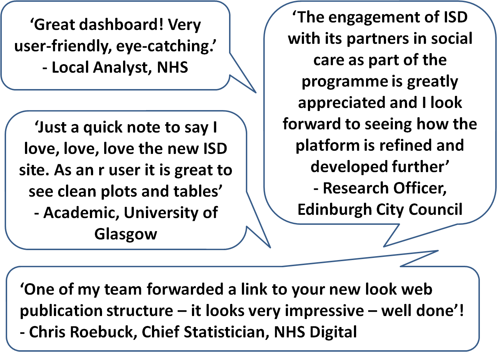

```{r setup, include = FALSE}
library(knitr)
knitr::opts_chunk$set(echo = FALSE)
```

## Background

- The Information Services Division (ISD) of NHS Scotland has a long history of producing official and national statistics. 
- We produce around 200 publications each year.
- Traditional publication format is a **static pdf document** with accompanying **excel tables**.
- Production uses **proprietary software** and is **time-consuming**, involving extensive manual formatting and checking.

```{r out.width = "40%", fig.align = 'center'}
include_graphics("images/pdf report.png")
```

## Vision

```{r out.width = "75%", fig.align = 'center'}
include_graphics("images/VisionPoster.png")
```

## Initial User Engagament

- Focus groups and interviews with over 10 different user groups.
- Determined user experiences of existing product and how the new product design could meet their needs.

```{r out.width = "90%", fig.align = 'center'}
include_graphics("images/user engagement.png")
```

## Personas

```{r out.width = "50%"}


```

- High-level user groups:
    - Curious
    - Focused
    - Detailed
    - Diggers

## Minimum Viable Product (MVP)

- [Acute Hospital Activity and Beds publication](http://www.isdscotland.org/Health-Topics/Hospital-Care/Publications/2018-06-26/Acute-Hospital-Publication/) released in December 2017.

```{r out.width = "75%", fig.align = 'center'}

```

## MVP: Data summary

```{r out.width = "80%", fig.align = 'center'}

```

## MVP: Trend data

```{r out.width = "75%", fig.align = 'center'}

```

## MVP: Data explorer

```{r out.width = "85%", fig.align = 'center'}

```

## MVP: Data files

```{r out.width = "80%", fig.align = 'center'}

```

## MVP: Further Information

```{r out.width = "95%", fig.align = 'center'}

```

- Includes:
    - metadata
    - methods and data quality issues
    - link to GitHub repo with data explorer code
    - feedback form and contact details

## User Feedback and Testing

```{r out.width = "85%", fig.align = 'center'}

```

## Next Steps

- **Psychiatric Hospital Activity publication** to be released 25 September 2018.
- **Thematic** approach to publications.
- Re-design of [Data quality](https://www.isdscotland.org/Health-Topics/Hospital-Care/Publications/2018-06-26/Acute-Hospital-Publication/data-quality/) page.
- Automate production process ([Reproducible Analytical Pipeline](https://ukgovdatascience.github.io/rap_companion/)).

```{r out.width = "60%", fig.align = 'center'}

```

## Thank You {.smaller}
<div class="columns-2">
<ul>
```{r out.width = "35%"}
include_graphics("images/Anna_Avatar.jpg")
```
<br>
```{r out.width = "10%"}
include_graphics("images/twitter.png")
```
@price_AH
<br>
```{r out.width = "10%", }
include_graphics("images/github.png")
```
annahprice
</ul>
<ul>
```{r out.width = "35%"}
include_graphics("images/David_Avatar.jpg")
```
<br>
```{r out.width = "10%"}
include_graphics("images/twitter.png")
```
@KingTyjet92
<br>
```{r out.width = "10%"}
include_graphics("images/github.png")
```
davidc92
</ul>
</div>

```{r out.width = "60%", fig.align='center'}
include_graphics("images/team.png")
```

Acute Activity publication: https://bit.ly/2PhLYbL

Transforming Publishing on GitHub: <br> https://github.com/NHS-NSS-transforming-publications

ISD on GitHub: https://github.com/Health-SocialCare-Scotland

ISD on Twitter: @NHSNSS


